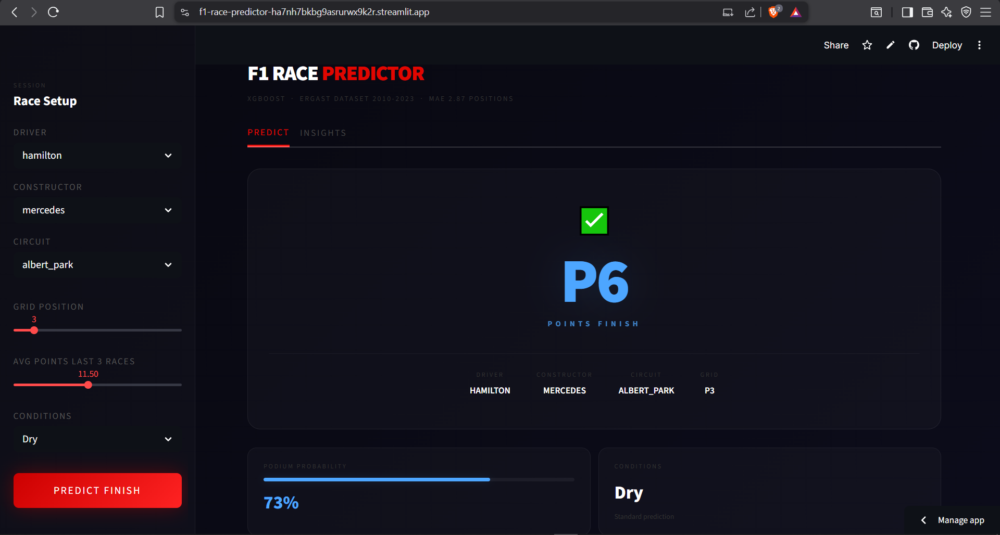
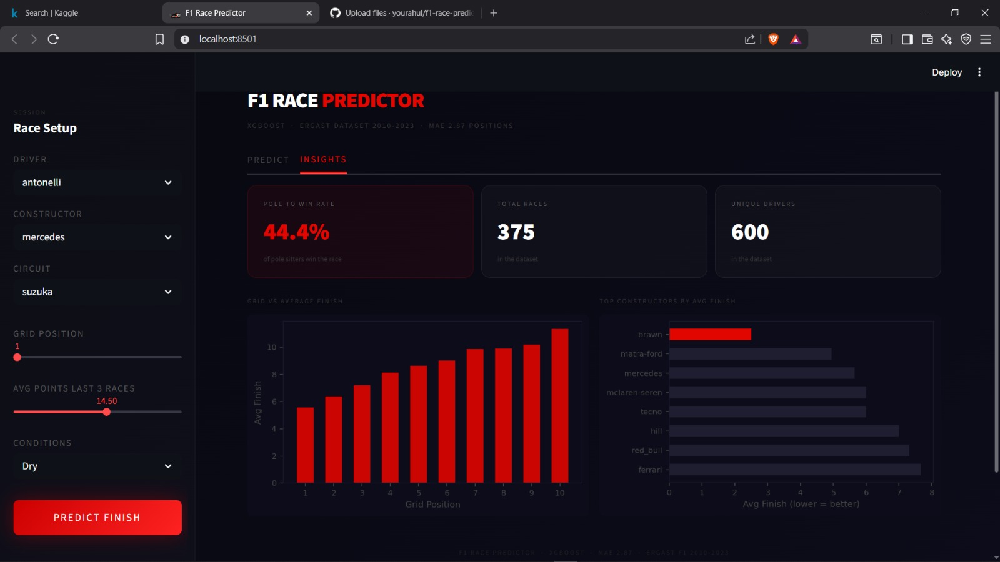

# F1 Race Finish Position Predictor 🏎️

🚀 **Live Demo:**
👉 https://f1-race-predictor-ha7nh7bkbg9asrurwx9k2r.streamlit.app/

---

## 📸 App Preview

### 🏁 Prediction Result


### 📊 Insights Dashboard


---

## ⚡ Overview

Predict Formula 1 race finishing positions using machine learning trained on real historical race data.

Built using **XGBoost** and deployed as an interactive **Streamlit web application**.

---

## 🚀 Features

* Predict finishing position based on:

  * Driver
  * Constructor
  * Circuit
  * Grid position
  * Recent performance

* Real-time prediction with interactive UI

* Insights dashboard with race statistics and trends

---

## 🧠 Tech Stack

* **Language:** Python
* **Libraries:** Pandas, NumPy
* **ML Model:** XGBoost Regressor
* **Framework:** Streamlit

---

## 📊 Model Performance

* Mean Absolute Error: **2.87 positions**
* Dataset: Ergast F1 dataset (2010–2023)
* Train/Test Split:

  * Train → 2010–2021
  * Test → 2022–2023

---

## 💡 Why this project

This project demonstrates how historical race data can be used to predict driver performance and understand race outcomes using machine learning.

It highlights the complete ML pipeline from **data processing → model training → deployment**.

---

## ⚙️ How to Run Locally

```bash
git clone https://github.com/yourahul/f1-race-predictor.git
cd f1-race-predictor
pip install -r requirements.txt
streamlit run app.py
```

---

## 📁 Project Structure

```
app.py                  # Streamlit application
F1_project.ipynb        # Data processing & model training
requirements.txt        # Dependencies

f1_model.pkl           # Trained model
le_driver.pkl          # Label encoder (driver)
le_constructor.pkl     # Label encoder (constructor)
le_circuit.pkl         # Label encoder (circuit)
```

---

## 👤 Author

Rahul U

[GitHub](https://github.com/yourahul) · [LinkedIn](https://www.linkedin.com/in/rahul-u-507b57286)
